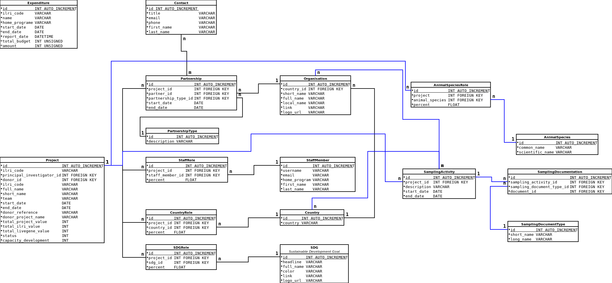

LiveGene
========

LiveGene is an abbreviation of **Live**stock **Gene**tics,
a program at ILRI (International Livestock Research Institute) in Nairobi, Kenya.

This application manages the projects within this program.

Application
-----------

The application is hosted with SymfonyCloud and is accessible under:

https://livegene.ilri.org

The application is programmed with PHP and uses the framework Symfony.
It requires PHP 7.4 and the LTS Symfony version 4.4. As of now (8th September 2021)
it uses the patch version 4.4.30.  
The version 4.4 is supported until November 2023.

It consists of 3 main parts:

- `/#/` -> frontend application built with Vue.js
- `/api` -> REST API built with API Platform
- `/admin` -> admin area built with SonataAdminBundle

Entity Relationship Model
-------------------------

The application uses MySQL for the data storage. The data model consists of 16 entities.

